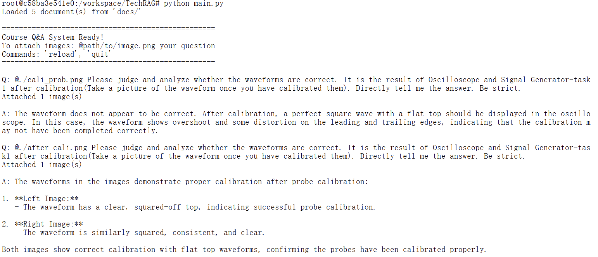

# TechRAG - Course Q&A System

A simple RAG system using OpenAI API to answer questions based on course markdown files. Supports image attachments for visual questions.

## Setup

1. Install dependencies:

```bash
pip install -r requirements.txt
```

2. Set your OpenAI API key:

```bash
export OPENAI_API_KEY=your_api_key_here
```

3. Add your course markdown files to the `docs/` directory.

## Usage

```bash
python main.py
```

### Asking Questions

```
Q: What is the main topic of lecture 1?
```

### Attaching Images

Use `@` prefix to attach images:

```
Q: @screenshot.png What does this diagram show?
Q: @fig1.jpg @fig2.png Compare these two figures
```

Supported formats: PNG, JPG, JPEG, GIF, WEBP

### Commands

- `reload` - Reload documents after adding new files
- `quit` - Exit the application

## Project Structure

```
TechRAG/
├── main.py           # Main application
├── requirements.txt  # Dependencies
├── docs/             # Place markdown files here
└── .env              # Environment variables (optional)
```

## Result - 0112


